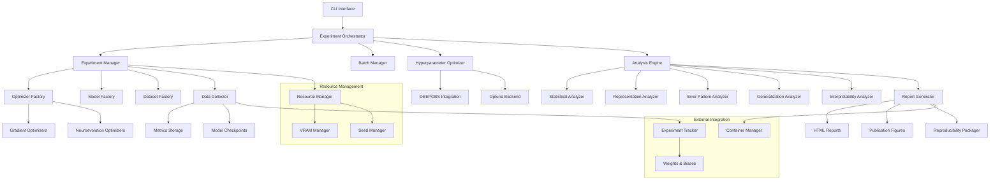

# Design Document: NERO Research Tool

## Overview

NERO (NeuroEvolution vs. Gradient Research Orchestrator) is designed as a modular, research-focused CLI tool that enables systematic comparison of gradient-based and neuroevolutionary optimizers. The architecture prioritizes scientific rigor, reproducibility, and extensibility while maintaining simplicity for research workflows.

### Design Principles

- **Domain-Driven Design**: Classes directly map to research concepts (Experiment, Optimizer, Analysis)
- **Separation of Concerns**: Clear boundaries between experimentation, analysis, and reporting
- **Reproducibility First**: All operations are deterministic and fully logged
- **Extensibility**: New optimizers and analysis methods can be added without core changes
- **Resource Awareness**: Dynamic adaptation to available computational resources

## Architecture

### High-Level System Architecture



### Core Domain Model

The system is built around key research domain concepts:

```python
# Core abstractions
class Experiment:
    """Represents a single research experiment"""
    
class ExperimentBatch:
    """Manages multiple experiments for comparison"""
    
class Optimizer(ABC):
    """Abstract base for all optimization strategies"""
    
class TrainingMetrics:
    """Immutable training results and metadata"""
    
class ComparisonResult:
    """Statistical comparison between optimizers"""
```

## Components and Interfaces

### 1. Experiment Orchestration Layer

**ExperimentManager**
- Coordinates single experiment execution
- Manages resource allocation and seed control
- Handles checkpoint saving and recovery
- Validates experimental setup for fairness

**BatchManager**
- Orchestrates multiple experiments for statistical comparison
- Ensures identical architectures across optimizer comparisons
- Manages parallel execution when resources allow
- Aggregates results for analysis

**ResourceManager**
- Dynamic VRAM management with adaptive batch sizing
- CPU/GPU resource monitoring and allocation
- Memory optimization for large-scale experiments
- Graceful degradation when resources are limited

### 2. Hyperparameter Optimization Layer

**HyperparameterOptimizer**
```python
class HyperparameterOptimizer:
    def __init__(self, framework: str = "optuna", budget_type: str = "epochs"):
        self.framework = framework
        self.budget_type = budget_type
        self.deepobs_integration = DEEPOBSIntegration()
        
    def optimize_optimizer_config(self, optimizer_name: str, 
                                 dataset: Dataset,
                                 base_model: nn.Module,
                                 budget: int) -> OptimizerConfig:
        """Fair HPO using established benchmarking protocols"""
        
        # Use DEEPOBS search spaces when available
        search_space = self.deepobs_integration.get_search_space(
            optimizer_name, dataset.name)
        
        if search_space is None:
            # Fallback to literature-based search spaces
            search_space = self._get_literature_search_space(optimizer_name)
        
        study = optuna.create_study(direction="maximize")
        study.optimize(
            lambda trial: self._objective(trial, optimizer_name, 
                                        dataset, base_model, budget),
            n_trials=budget if self.budget_type == "trials" else None,
            timeout=budget if self.budget_type == "time" else None
        )
        
        return OptimizerConfig(
            name=optimizer_name,
            params=study.best_params,
            search_space=search_space,
            optimization_history=study.trials_dataframe()
        )

class DEEPOBSIntegration:
    """Integration with DEEPOBS benchmarking framework"""
    
    def get_search_space(self, optimizer_name: str, 
                        dataset_name: str) -> Optional[Dict]:
        """Retrieve established search spaces from DEEPOBS"""
        deepobs_spaces = {
            ("adam", "mnist"): {
                "learning_rate": (1e-5, 1e-1, "log"),
                "beta1": (0.8, 0.99),
                "beta2": (0.9, 0.999),
                "weight_decay": (0, 1e-3)
            },
            ("sgd", "mnist"): {
                "learning_rate": (1e-4, 1e0, "log"),
                "momentum": (0.0, 0.99),
                "weight_decay": (0, 1e-3)
            }
            # Additional established search spaces...
        }
        return deepobs_spaces.get((optimizer_name, dataset_name))
```

### 3. Optimizer Implementations

**GradientOptimizer**
```python
class GradientOptimizer(Optimizer):
    def __init__(self, config: OptimizerConfig):
        self.config = config
        self.optimizer_type = config.name
        
    def optimize(self, model: nn.Module, dataset: Dataset, 
                epochs: int, logger: ExperimentLogger) -> TrainingMetrics:
        """Decoupled optimization with callback-based logging"""
        optimizer = self._create_torch_optimizer(model.parameters(), 
                                                self.config.params)
        criterion = nn.CrossEntropyLoss()
        
        for epoch in range(epochs):
            train_loss, train_acc = self._train_epoch(
                model, dataset.get_train_loader(), optimizer, criterion)
            test_loss, test_acc = self._evaluate(
                model, dataset.get_test_loader(), criterion)
            
            # Collect gradient statistics
            grad_norm = self._compute_gradient_norm(model)
            
            # Use logger callbacks instead of returning metrics directly
            logger.log_epoch(epoch, {
                'train_loss': train_loss,
                'train_accuracy': train_acc,
                'test_loss': test_loss,
                'test_accuracy': test_acc,
                'gradient_norm': grad_norm
            })
            
        return logger.get_metrics()
```

**NeuroevolutionOptimizer**
```python
class NeuroevolutionOptimizer(Optimizer):
    def __init__(self, config: OptimizerConfig):
        self.config = config
        self.algorithm = config.name
        
    def optimize(self, model: nn.Module, dataset: Dataset, 
                epochs: int, logger: ExperimentLogger) -> TrainingMetrics:
        """Evolutionary training with behavioral diversity tracking"""
        population = self._initialize_population(model, self.config.params)
        diversity_tracker = BehavioralDiversityTracker()
        
        for generation in range(epochs):
            fitness_scores = self._evaluate_population(population, dataset)
            best_individual = self._get_best_individual(population, fitness_scores)
            
            # Compute behavioral diversity
            sample_batch, _ = dataset.get_sample_batch(100)
            diversity = diversity_tracker.compute_diversity(
                population, sample_batch, layer_name=self.config.analysis_layer)
            
            # Log metrics using callback system
            train_loss, train_acc = self._evaluate_individual(
                best_individual, dataset.get_train_loader())
            test_loss, test_acc = self._evaluate_individual(
                best_individual, dataset.get_test_loader())
            
            logger.log_epoch(generation, {
                'train_loss': train_loss,
                'train_accuracy': train_acc,
                'test_loss': test_loss,
                'test_accuracy': test_acc,
                'population_diversity': diversity,
                'best_fitness': max(fitness_scores)
            })
            
            population = self._evolve_population(population, fitness_scores)
            
        return logger.get_metrics()
```

**Key Implementation Details:**
- **Behavioral Diversity Calculation**: For neuroevolution, compute phenotypic diversity using activation pattern distances between population members
- **Fair Comparison Enforcement**: Identical model initialization across optimizers within each replication
- **Gradient Statistics**: Collect gradient norms, variance, and sparsity for gradient-based methods

### 3. Data Collection and Storage

**MetricsCollector**
- Per-epoch logging of loss, accuracy, training time
- Optimizer-specific metrics (gradient norms, population diversity)
- Resource utilization tracking (GPU memory, compute time)
- Structured storage in CSV/Parquet format

**CheckpointManager**
- Model state saving at start, mid-training, and final epochs
- Versioned checkpoint storage with metadata
- Efficient loading for analysis and comparison
- Automatic cleanup of old checkpoints

**BehavioralDiversityTracker** (for neuroevolution)
```python
class BehavioralDiversityTracker:
    def compute_diversity(self, population: List[nn.Module], 
                         sample_data: torch.Tensor,
                         layer_name: str) -> float:
        """Compute phenotypic diversity using activation distances"""
        activations = []
        for individual in population:
            with torch.no_grad():
                activation = individual.get_activations(sample_data, layer_name)
                activations.append(activation.flatten())
        
        # Compute pairwise distances and return diversity metric
        distances = pdist(torch.stack(activations).cpu().numpy())
        return np.mean(distances)

class ExperimentLogger:
    """Decoupled logging system with external tracker integration"""
    
    def __init__(self, experiment_id: str, run_id: int, 
                 external_tracker: Optional[ExperimentTracker] = None):
        self.experiment_id = experiment_id
        self.run_id = run_id
        self.external_tracker = external_tracker
        self.metrics = []
        
    def log_epoch(self, epoch: int, metrics: Dict[str, float]) -> None:
        """Log epoch metrics to both local storage and external tracker"""
        epoch_data = {'epoch': epoch, **metrics}
        self.metrics.append(epoch_data)
        
        if self.external_tracker:
            self.external_tracker.log_metrics(epoch_data, step=epoch)
    
    def get_metrics(self) -> TrainingMetrics:
        """Convert logged data to TrainingMetrics object"""
        return TrainingMetrics.from_log_data(
            self.experiment_id, self.run_id, self.metrics)

class ExperimentTracker(ABC):
    """Abstract base for external experiment tracking"""
    
    @abstractmethod
    def log_metrics(self, metrics: Dict[str, float], step: int) -> None:
        pass
    
    @abstractmethod
    def log_hyperparameters(self, params: Dict[str, Any]) -> None:
        pass

class WandBTracker(ExperimentTracker):
    """Weights & Biases integration"""
    
    def __init__(self, project_name: str, experiment_name: str):
        import wandb
        self.run = wandb.init(project=project_name, name=experiment_name)
    
    def log_metrics(self, metrics: Dict[str, float], step: int) -> None:
        self.run.log(metrics, step=step)
    
    def log_hyperparameters(self, params: Dict[str, Any]) -> None:
        self.run.config.update(params)
```

### 4. Analysis Engine

**StatisticalAnalyzer**
- T-tests and effect size calculations (Cohen's d)
- Confidence interval computation
- Multiple comparison corrections (Bonferroni, FDR)
- Power analysis and sample size recommendations

**RepresentationAnalyzer**
```python
class RepresentationAnalyzer:
    def __init__(self):
        self.methods = {
            'linear_probe': LinearProbeAnalyzer(),
            'cka': CKAAnalyzer(),
            'activation_analysis': ActivationAnalyzer()
        }
    
    def compare_representations(self, model_a: nn.Module, 
                              model_b: nn.Module, 
                              dataset: Dataset) -> RepresentationComparison:
        """Primary analysis using linear probes with CKA validation"""
        # Linear probe analysis (primary method)
        probe_results = self.methods['linear_probe'].analyze(
            model_a, model_b, dataset)
        
        # CKA analysis (exploratory, requires validation)
        cka_results = self.methods['cka'].analyze(
            model_a, model_b, dataset)
        
        # Cross-validate CKA findings with linear probes
        validated_results = self._cross_validate_cka(
            probe_results, cka_results)
        
        return RepresentationComparison(
            primary_analysis=probe_results,
            exploratory_analysis=cka_results,
            cross_validation=validated_results
        )
```

**InterpretabilityAnalyzer**
```python
class InterpretabilityAnalyzer:
    def __init__(self, method: str = "lrp"):
        self.method = method
        self.lrp_analyzer = LRPAnalyzer()
        self.gradient_analyzer = GradientAttributionAnalyzer()
        
    def analyze_model_focus(self, model: nn.Module, 
                           dataset: Dataset,
                           sample_indices: List[int]) -> InterpretabilityResult:
        """Apply LRP and gradient-based attribution to understand model focus"""
        try:
            # Primary method: Layer-wise Relevance Propagation
            lrp_results = self.lrp_analyzer.compute_relevance(
                model, dataset, sample_indices)
            
            attribution_method = "lrp"
            attribution_maps = lrp_results.relevance_maps
            
        except Exception as e:
            # Fallback to gradient-based methods
            logging.warning(f"LRP failed: {e}. Falling back to gradient attribution.")
            grad_results = self.gradient_analyzer.compute_attribution(
                model, dataset, sample_indices)
            
            attribution_method = "gradient"
            attribution_maps = grad_results.attribution_maps
        
        return InterpretabilityResult(
            method=attribution_method,
            attribution_maps=attribution_maps,
            sample_indices=sample_indices,
            model_id=model.get_model_id()
        )
    
    def compare_attention_patterns(self, model_a: nn.Module, 
                                  model_b: nn.Module,
                                  dataset: Dataset) -> AttentionComparison:
        """Compare what different optimizers learn to focus on"""
        sample_indices = list(range(50))  # Analyze first 50 test samples
        
        results_a = self.analyze_model_focus(model_a, dataset, sample_indices)
        results_b = self.analyze_model_focus(model_b, dataset, sample_indices)
        
        # Compute attention pattern similarity
        attention_similarity = self._compute_attention_similarity(
            results_a.attribution_maps, results_b.attribution_maps)
        
        return AttentionComparison(
            model_a_results=results_a,
            model_b_results=results_b,
            attention_similarity=attention_similarity,
            divergent_samples=self._find_divergent_attention_samples(
                results_a, results_b)
        )

class LRPAnalyzer:
    """Layer-wise Relevance Propagation implementation"""
    
    def compute_relevance(self, model: nn.Module, dataset: Dataset,
                         sample_indices: List[int]) -> LRPResult:
        """Compute LRP relevance maps for specified samples"""
        # Implementation would use libraries like Captum or custom LRP
        relevance_maps = []
        
        for idx in sample_indices:
            sample, target = dataset.get_sample(idx)
            relevance = self._lrp_forward_backward(model, sample, target)
            relevance_maps.append(relevance)
        
        return LRPResult(
            relevance_maps=relevance_maps,
            sample_indices=sample_indices
        )

**GeneralizationAnalyzer**
```python
class GeneralizationAnalyzer:
    def analyze_shortcut_learning(self, model: nn.Module, 
                                dataset: Dataset) -> ShortcutAnalysis:
        """Detect texture vs shape bias and other shortcuts"""
        # Test on texture-shape conflicted stimuli
        texture_bias = self._measure_texture_bias(model, dataset)
        
        # Test on adversarially filtered datasets
        robustness_scores = self._test_spurious_correlation_removal(
            model, dataset)
        
        return ShortcutAnalysis(
            texture_bias_score=texture_bias,
            robustness_scores=robustness_scores,
            generalization_gaps=self._compute_generalization_gaps(model)
        )
```

**ErrorPatternAnalyzer**
- Sample-level disagreement identification
- Confusion matrix generation and comparison
- Systematic error pattern detection
- Confidence-based disagreement analysis

### 5. Computational Reproducibility Layer

**ReproducibilityPackager**
```python
class ReproducibilityPackager:
    def __init__(self, experiment_results: Dict[str, ExperimentResult]):
        self.results = experiment_results
        self.container_manager = ContainerManager()
        self.dependency_manager = DependencyManager()
        
    def create_reproducibility_package(self, output_path: Path) -> ReproducibilityPackage:
        """Create complete reproducibility package for publication"""
        
        # 1. Container definition with exact environment
        container_def = self.container_manager.create_container_definition(
            base_image="pytorch/pytorch:2.0.1-cuda11.7-cudnn8-runtime",
            python_packages=self.dependency_manager.get_locked_dependencies(),
            system_packages=self._get_system_requirements()
        )
        
        # 2. Automated workflow script
        workflow_script = self._generate_workflow_script()
        
        # 3. Versioned data and model artifacts
        artifact_manifest = self._create_artifact_manifest()
        
        # 4. Complete configuration bundle
        config_bundle = self._bundle_configurations()
        
        package = ReproducibilityPackage(
            container_definition=container_def,
            workflow_script=workflow_script,
            artifact_manifest=artifact_manifest,
            configuration_bundle=config_bundle,
            verification_checksums=self._compute_verification_checksums()
        )
        
        package.save(output_path)
        return package
    
    def _generate_workflow_script(self) -> str:
        """Generate automated script to reproduce all results"""
        script_lines = [
            "#!/bin/bash",
            "# Automated reproduction script for NERO experiments",
            "set -e",
            "",
            "# Download and verify datasets",
            "python -m nero.data.download --verify-checksums",
            "",
            "# Run all experiments",
        ]
        
        for experiment_id in self.results.keys():
            script_lines.append(f"python -m nero.cli run-experiment configs/{experiment_id}.yaml")
        
        script_lines.extend([
            "",
            "# Generate all analyses and reports",
            "python -m nero.cli analyze --all-experiments",
            "python -m nero.cli generate-report --publication-ready",
            "",
            "echo 'Reproduction complete. Results in experiments/ directory.'"
        ])
        
        return "\n".join(script_lines)

class ContainerManager:
    """Manages containerization for reproducibility"""
    
    def create_container_definition(self, base_image: str,
                                   python_packages: Dict[str, str],
                                   system_packages: List[str]) -> ContainerDefinition:
        """Create Docker/Apptainer definition with exact dependencies"""
        
        dockerfile_content = f"""
FROM {base_image}

# Install system dependencies
RUN apt-get update && apt-get install -y {' '.join(system_packages)}

# Install exact Python package versions
COPY requirements.lock.txt /tmp/
RUN pip install --no-deps -r /tmp/requirements.lock.txt

# Copy NERO source code
COPY nero/ /app/nero/
WORKDIR /app

# Set reproducible environment variables
ENV PYTHONHASHSEED=0
ENV CUBLAS_WORKSPACE_CONFIG=:4096:8

ENTRYPOINT ["python", "-m", "nero.cli"]
"""
        
        return ContainerDefinition(
            dockerfile=dockerfile_content,
            base_image=base_image,
            python_packages=python_packages,
            build_args={}
        )

class DependencyManager:
    """Manages exact dependency versions for reproducibility"""
    
    def get_locked_dependencies(self) -> Dict[str, str]:
        """Get exact versions of all dependencies"""
        import pkg_resources
        
        installed_packages = {}
        for dist in pkg_resources.working_set:
            installed_packages[dist.project_name] = dist.version
        
        # Filter to only include packages we actually use
        required_packages = [
            'torch', 'torchvision', 'numpy', 'scipy', 'matplotlib',
            'pandas', 'scikit-learn', 'optuna', 'wandb', 'captum',
            'seaborn', 'tqdm', 'pyyaml', 'h5py'
        ]
        
        return {pkg: installed_packages[pkg] for pkg in required_packages 
                if pkg in installed_packages}

### 6. Resource Management

**VRAMManager**
```python
class VRAMManager:
    def __init__(self):
        self.available_memory = torch.cuda.get_device_properties(0).total_memory
        self.safety_margin = 0.1  # 10% safety margin
        
    def optimize_batch_size(self, model: nn.Module, 
                           initial_batch_size: int) -> int:
        """Dynamically adjust batch size to maximize VRAM usage"""
        max_safe_memory = self.available_memory * (1 - self.safety_margin)
        
        # Binary search for optimal batch size
        low, high = 1, initial_batch_size * 2
        optimal_batch_size = initial_batch_size
        
        while low <= high:
            mid = (low + high) // 2
            if self._test_batch_size(model, mid, max_safe_memory):
                optimal_batch_size = mid
                low = mid + 1
            else:
                high = mid - 1
                
        return optimal_batch_size
```

**SeedManager**
```python
class SeedManager:
    def __init__(self, base_seed: int):
        self.base_seed = base_seed
        
    def get_experiment_seeds(self, experiment_id: str, 
                           num_runs: int) -> Dict[str, int]:
        """Generate deterministic seeds for fair comparison"""
        return {
            'model_init': self.base_seed + hash(experiment_id) % 10000,
            'data_shuffle': self.base_seed + hash(experiment_id + '_data') % 10000,
            'optimizer_seeds': [
                self.base_seed + hash(f"{experiment_id}_run_{i}") % 10000 
                for i in range(num_runs)
            ]
        }
```

## Data Models

### Core Value Objects

```python
@dataclass(frozen=True)
class ExperimentConfig:
    """Immutable experiment configuration"""
    experiment_id: str
    optimizer_name: str
    dataset_name: str
    model_architecture: str
    epochs: int
    num_runs: int
    random_seed_base: int
    hpo_budget: int
    hpo_budget_type: str  # 'trials', 'time', 'epochs'
    
    def validate(self) -> List[str]:
        """Validate configuration and return any errors"""
        errors = []
        if self.epochs <= 0:
            errors.append("Epochs must be positive")
        if self.num_runs < 30:
            errors.append("Minimum 30 runs required for statistical validity")
        if self.hpo_budget <= 0:
            errors.append("HPO budget must be positive")
        return errors

@dataclass(frozen=True)
class OptimizerConfig:
    """Optimized hyperparameter configuration for an optimizer"""
    name: str
    params: Dict[str, Any]
    search_space: Dict[str, Any]
    optimization_history: pd.DataFrame
    hpo_method: str
    budget_used: int

@dataclass(frozen=True)
class TrainingMetrics:
    """Complete training run results"""
    experiment_id: str
    run_id: int
    optimizer_name: str
    epochs: List[int]
    train_losses: List[float]
    train_accuracies: List[float]
    test_losses: List[float]
    test_accuracies: List[float]
    training_times: List[float]
    
    # Optimizer-specific metrics
    gradient_norms: Optional[List[float]] = None
    population_diversity: Optional[List[float]] = None
    
    # Resource usage
    peak_memory_usage: float = 0.0
    total_training_time: float = 0.0

@dataclass(frozen=True)
class RepresentationComparison:
    """Results of representation similarity analysis"""
    layer_name: str
    linear_probe_accuracy: float
    cka_similarity: float
    cka_sensitivity_analysis: Dict[str, float]
    cross_validation_passed: bool
    activation_statistics: Dict[str, float]

@dataclass(frozen=True)
class InterpretabilityResult:
    """Results of interpretability analysis"""
    method: str  # 'lrp', 'gradient', etc.
    attribution_maps: List[np.ndarray]
    sample_indices: List[int]
    model_id: str

@dataclass(frozen=True)
class AttentionComparison:
    """Comparison of attention patterns between models"""
    model_a_results: InterpretabilityResult
    model_b_results: InterpretabilityResult
    attention_similarity: float
    divergent_samples: List[int]

@dataclass(frozen=True)
class ReproducibilityPackage:
    """Complete package for reproducing research results"""
    container_definition: ContainerDefinition
    workflow_script: str
    artifact_manifest: Dict[str, str]
    configuration_bundle: Dict[str, Any]
    verification_checksums: Dict[str, str]
```

### Storage Schema

**Experiment Results Directory Structure:**
```
experiments/
├── {experiment_id}/
│   ├── config.yaml
│   ├── metadata.json
│   ├── hpo/
│   │   ├── search_spaces.json
│   │   ├── optimization_history.csv
│   │   └── best_configs.json
│   ├── runs/
│   │   ├── run_000/
│   │   │   ├── metrics.csv
│   │   │   ├── checkpoints/
│   │   │   │   ├── epoch_000.pt
│   │   │   │   ├── epoch_050.pt
│   │   │   │   └── epoch_100.pt
│   │   │   └── logs/
│   │   └── run_001/
│   ├── analysis/
│   │   ├── statistical_summary.json
│   │   ├── representation_analysis.json
│   │   ├── interpretability_analysis.json
│   │   └── generalization_analysis.json
│   └── reports/
│       ├── comparison_report.html
│       └── figures/
├── reproducibility_package/
│   ├── Dockerfile
│   ├── requirements.lock.txt
│   ├── reproduce_results.sh
│   ├── data_checksums.md5
│   └── artifact_manifest.json
```

## Error Handling

### Graceful Degradation Strategy

1. **Resource Constraints**: Automatically reduce batch size, warn about potential impact
2. **Hardware Failures**: Save partial results, enable experiment resumption
3. **Data Issues**: Skip corrupted samples, log data quality metrics
4. **Analysis Failures**: Provide partial results, clear error reporting

### Validation and Verification

```python
class ExperimentValidator:
    def validate_fair_comparison(self, experiments: List[Experiment]) -> ValidationResult:
        """Ensure experiments are comparable"""
        # Check architecture consistency
        architectures = [exp.get_architecture_hash() for exp in experiments]
        if len(set(architectures)) > 1:
            return ValidationResult(
                valid=False, 
                error="Architecture mismatch detected"
            )
        
        # Check seed management
        seed_conflicts = self._check_seed_conflicts(experiments)
        if seed_conflicts:
            return ValidationResult(
                valid=False,
                error=f"Seed conflicts: {seed_conflicts}"
            )
        
        return ValidationResult(valid=True)
```

## Testing Strategy

### Unit Testing
- Individual component testing with mocked dependencies
- Optimizer implementation validation
- Statistical analysis correctness verification
- Resource management edge cases

### Integration Testing
- End-to-end experiment execution
- Cross-optimizer comparison validation
- Report generation completeness
- Resource constraint handling

### Research Validation Testing
```python
class ResearchValidationTests:
    def test_known_optimizer_differences(self):
        """Verify tool detects known differences between optimizers"""
        # Use synthetic data where we know the ground truth
        pass
        
    def test_statistical_power(self):
        """Verify statistical tests have adequate power"""
        # Power analysis for different effect sizes
        pass
        
    def test_reproducibility(self):
        """Verify identical results with same seeds"""
        # Run same experiment twice, compare results
        pass
```

## Performance Considerations

### Computational Efficiency
- **Parallel Execution**: Multiple runs can execute in parallel when resources allow
- **Checkpoint Optimization**: Efficient model state serialization
- **Memory Management**: Automatic garbage collection between runs
- **Batch Processing**: Vectorized operations for analysis computations

### Scalability
- **Modular Analysis**: Analysis components can be run independently
- **Incremental Processing**: Results can be analyzed as experiments complete
- **Storage Optimization**: Compressed checkpoint storage for long-term retention

## Security and Privacy

### Data Protection
- No external data transmission (fully local operation)
- Secure temporary file handling
- Automatic cleanup of intermediate results

### Reproducibility Security
- Cryptographic hashing of configurations and results
- Tamper-evident experiment logs
- Version control integration for full provenance tracking

This design provides a robust foundation for systematic optimizer comparison while maintaining the flexibility needed for research exploration and the rigor required for publication-quality results.